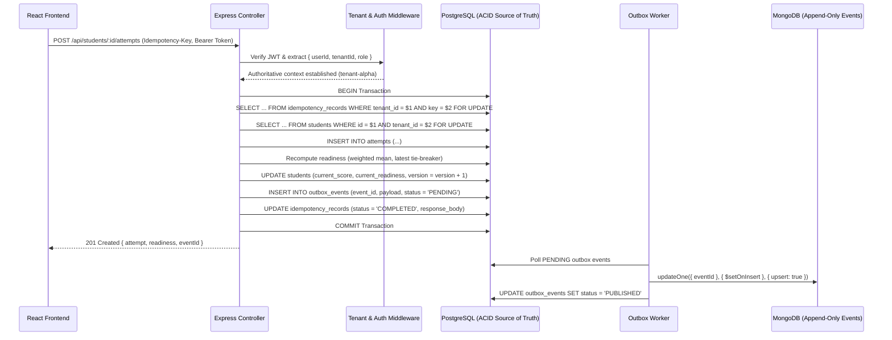

# LIVE DEFENSE & EVALUATION GUIDE
**Project**: Student Readiness Control Center  
**Repository**: `student-readiness-control-center`  
**Purpose**: Step-by-step instructions, curl commands, and architectural explanations for the Part D live defense.

---

## 1. Quick Demonstration Commands

### Step 1: Start PostgreSQL & MongoDB
```powershell
# Verify MongoDB service is running
Get-Service MongoDB

# Verify PostgreSQL is running on port 5433
Test-NetConnection -ComputerName 127.0.0.1 -Port 5433
```

### Step 2: Run Full Automated Test Suite
```powershell
# Run backend domain, integration, idempotency, and failure injection tests
npm --prefix backend test

# Run frontend resilience, cancellation, and conflict tests
npm --prefix frontend test
```

### Step 3: Start Application Servers
```powershell
# Terminal 1 - Backend (Port 5002)
npm --prefix backend run dev

# Terminal 2 - Frontend (Port 5175)
npm --prefix frontend run dev
```

---

## 2. Request Lifecycle Trace (Browser to MongoDB)

Demonstrate tracing an assessment submission end-to-end:



---

## 3. Live Demonstration #1: Concurrent Idempotent Retries

### The Demonstration:
Send two parallel HTTP requests with identical `Idempotency-Key` and identical payload:

```bash
# Obtain token for Alpha Evaluator
TOKEN=$(curl -s -X POST http://localhost:5002/api/auth/login \
  -H "Content-Type: application/json" \
  -d '{"email":"evaluator@alpha.com","password":"Password123!"}' | jq -r .token)

# Send two parallel requests simultaneously using curl
KEY="demo-key-$(date +%s)"
PAYLOAD='{"competencyKey":"frontend","score":92,"notes":"Live defense idempotency test"}'

# Run in parallel in background
curl -s -X POST "http://localhost:5002/api/students/student-alpha-3/attempts" \
  -H "Authorization: Bearer $TOKEN" \
  -H "Idempotency-Key: $KEY" \
  -H "Content-Type: application/json" \
  -d "$PAYLOAD" &

curl -s -X POST "http://localhost:5002/api/students/student-alpha-3/attempts" \
  -H "Authorization: Bearer $TOKEN" \
  -H "Idempotency-Key: $KEY" \
  -H "Content-Type: application/json" \
  -d "$PAYLOAD" &
wait
```

### Expected Result:
- Both requests return `201 Created` with identical body.
- One response includes `X-Idempotency-Replay: true`.
- PostgreSQL inspection proves **exactly one attempt was inserted**:
  ```sql
  SELECT id, score, submitted_at FROM attempts WHERE student_id = 'student-alpha-3' AND notes = 'Live defense idempotency test';
  ```

---

## 4. Live Demonstration #2: Cross-Tenant Denial (Zero Leakage)

### The Demonstration:
Tenant Alpha evaluator attempts to access or submit attempts for Tenant Beta's student (`student-beta-1`):

```bash
# Request student belonging to another tenant
curl -s -w "\nHTTP Status: %{http_code}\n" \
  -X GET "http://localhost:5002/api/students/student-beta-1" \
  -H "Authorization: Bearer $TOKEN"
```

### Expected Result:
- Status: `404 Not Found`.
- Response: `{"code":"NOT_FOUND","message":"Student not found.","requestId":"req_...","fieldErrors":{}}`.
- **Zero Information Leak**: Does not disclose whether `student-beta-1` exists.

---

## 5. Live Demonstration #3: Simulated MongoDB Outage & Outbox Recovery

1. Stop MongoDB service or simulate outage in code.
2. Submit assessment attempt:
   - PostgreSQL transaction commits cleanly.
   - HTTP response returns `201 Created`.
   - Student readiness is updated in PostgreSQL.
   - Outbox table contains row with `status = 'PENDING'`.
3. Restart MongoDB service.
4. Background worker flushes pending events.
5. MongoDB contains exactly one document with `eventId`.

---

## 6. System Strengths & Known Limitations

### One Failure the System Handles Gracefully:
- **Transient MongoDB Outage**: Because operational events are staged into PostgreSQL's transactional `outbox_events` table inside the same transaction as the attempt write, a failure or network partition with MongoDB **never rolls back relational transactions** and **never causes audit event loss**.

### One Failure It Does Not Yet Handle:
- **Cross-Region Database Replication Lag**: If PostgreSQL is deployed across multiple geographic regions with asynchronous read-replicas, a read immediately following a write could potentially hit an out-of-date read-replica unless stickied to the primary node. In the current design, all writes and authoritative reads are directed to the primary PostgreSQL connection pool.

---

## 7. Live Modification Cheat Sheet (Answering the 5 Evaluator Changes)

### CHANGE 1: Add a 5th Competency Without Hardcoding Everywhere
- **Where to change**: Database only (`competencies` table)!
  ```sql
  INSERT INTO competencies (id, key, name, weight, active) 
  VALUES ('comp-cloud', 'cloud', 'Cloud & DevOps', 0.10, TRUE);
  ```
- **Why zero code rewrite is needed**: `readinessService.js` dynamically fetches all active competencies from PostgreSQL. The formula normalizes weighted points by total active weight dynamically!

### CHANGE 2: Change Readiness Threshold & Update Minimum Tests
- **Where to change**:
  1. `backend/src/services/readinessService.js` (lines 80-90: change `80.00` to `85.00`).
  2. `backend/src/db/queries/a4ScoringQuery.js` (lines 62-65: change `80` to `85`).
  3. `backend/tests/domain/readinessService.test.js` (update test `score = 80.00 produces READY` to expect `NEARLY_READY`, and add test for `85.00`).

### CHANGE 3: Add a New Student Filter (e.g. `minScore`)
- **Where to change**:
  1. `backend/src/controllers/studentController.js`: add `if (req.query.minScore) { conditions.push('current_score >= $' + paramIndex); params.push(Number(req.query.minScore)); paramIndex++; }`.
  2. `frontend/src/components/StudentFilters.tsx`: add input bound to `filters.minScore`.
  3. `frontend/src/utils/urlState.ts`: add `minScore` to URL sync helper.
  - Automatically preserves debouncing, AbortController cancellation, and pagination stability!

### CHANGE 4: Make MongoDB Event Publishing Retry-Safe
- **Already fully implemented in `backend/src/services/eventPublisher.js`**:
  - Uses transactional outbox pattern.
  - MongoDB unique index on `eventId`.
  - Background worker polls pending events with retry counter and exponential backoff.

### CHANGE 5: Fix an Introduced Authorization or Mass-Assignment Vulnerability
- **Defense rule**:
  - Never allow `Model.create(req.body)` or `UPDATE ... SET ... req.body`.
  - Always pass parameters through `allowlistFields(req.body, ['name', 'email'])` in `validation.js`.
  - Always enforce `req.tenantId = req.user.tenantId` in `tenant.js`.

---

## 8. Key Files to Open During Defense

| Layer | File Path |
| :--- | :--- |
| **Pessimistic Row Lock & Transaction Boundary** | `backend/src/services/attemptService.js` |
| **Data-Driven Readiness Engine** | `backend/src/services/readinessService.js` |
| **Idempotency & Fingerprinting** | `backend/src/services/idempotencyService.js` |
| **Transactional Outbox Worker** | `backend/src/services/eventPublisher.js` |
| **A4 Authoritative Scoring Query** | `backend/src/db/queries/a4ScoringQuery.js` |
| **Tenant Isolation Middleware** | `backend/src/middleware/tenant.js` |
| **Frontend Discriminated Union & AbortController** | `frontend/src/hooks/useStudents.ts` |
| **Seeded Defect Fix** | `frontend/src/App.tsx` & `frontend/src/tests/frontendResilience.test.tsx` |
| **Incident Investigation Document** | `INCIDENT.md` |
